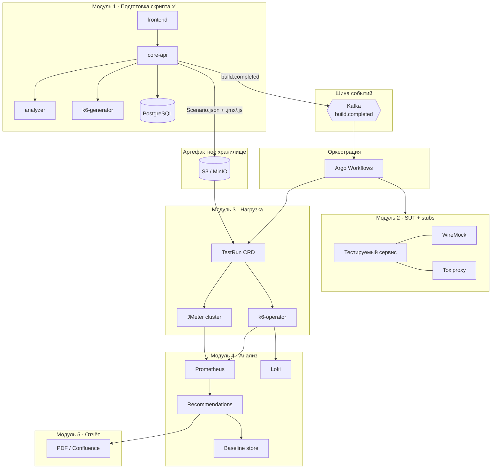
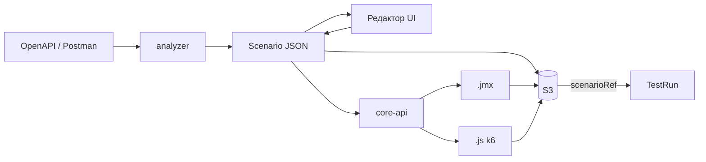
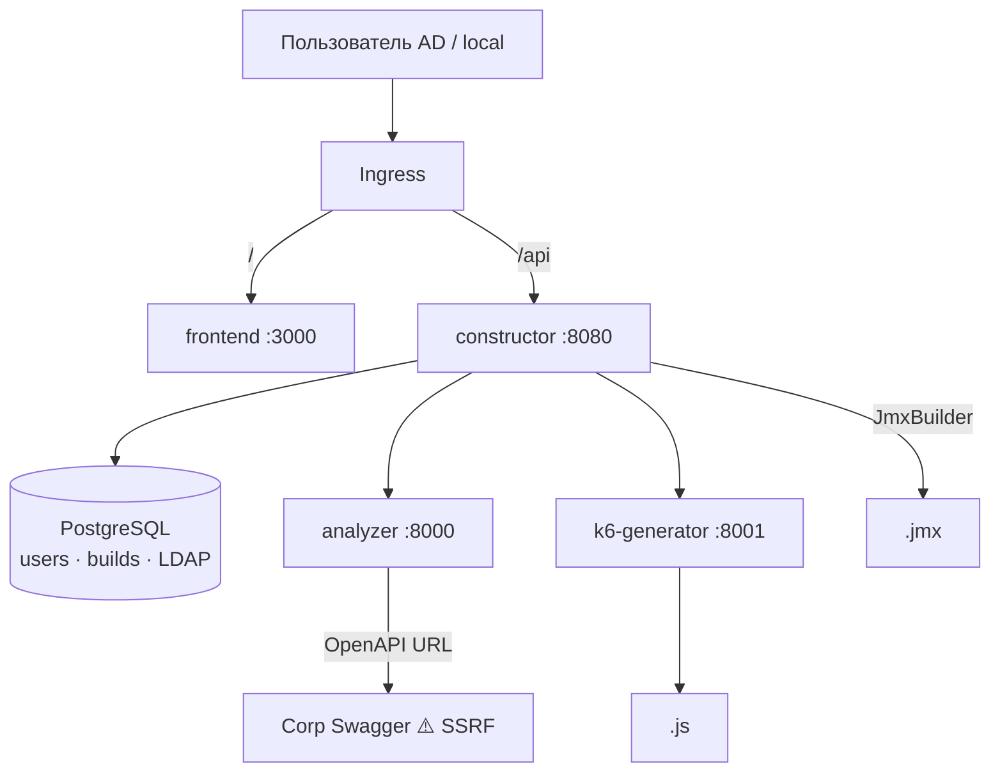
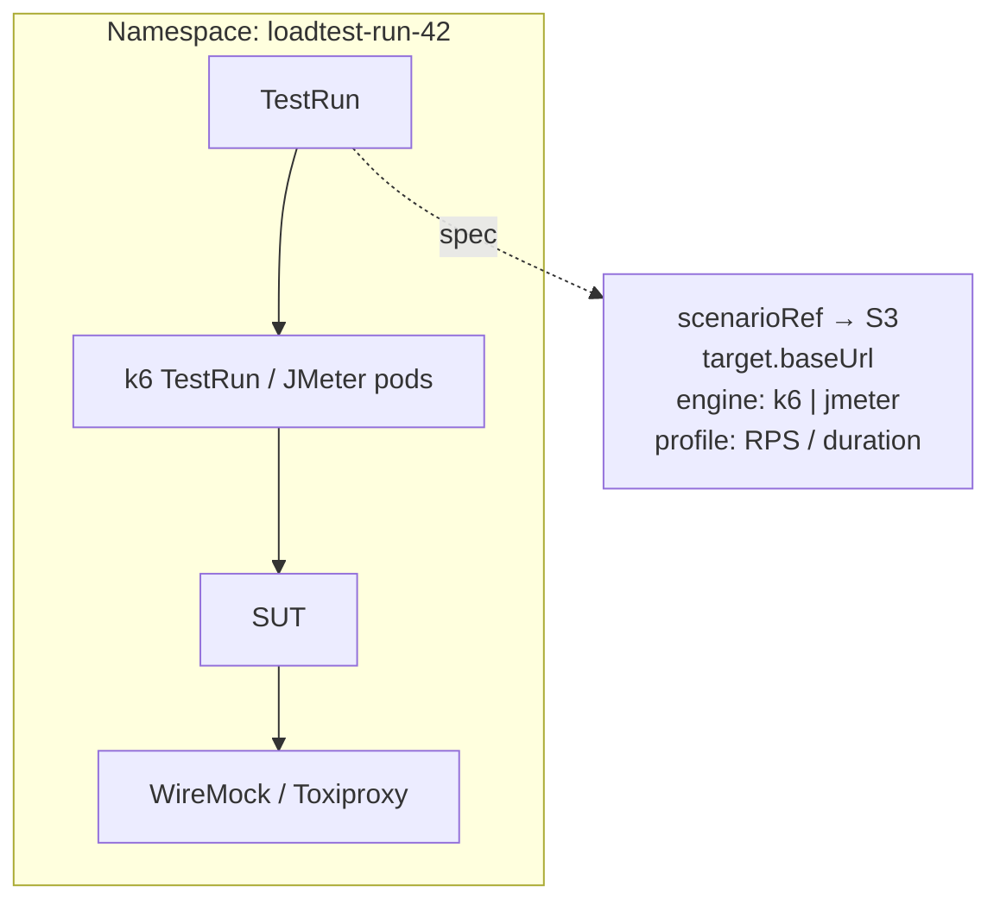
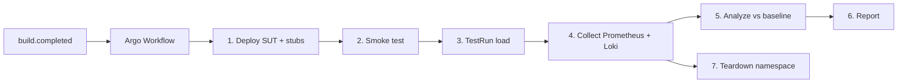
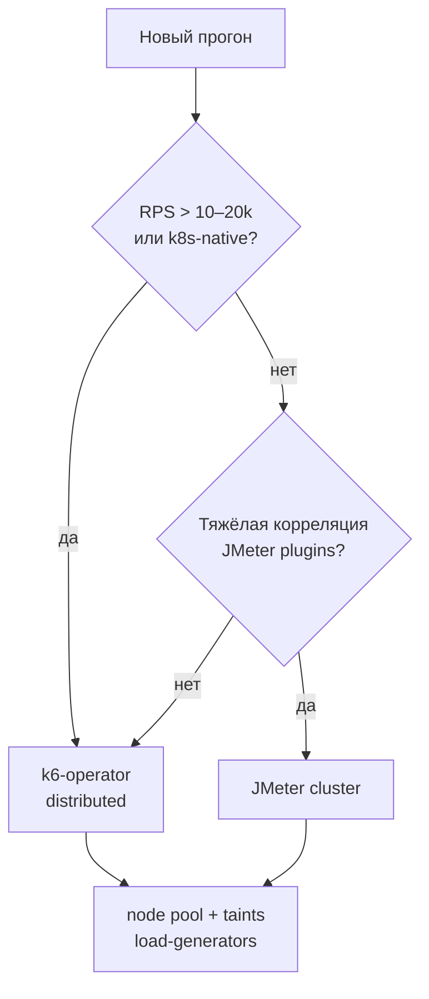
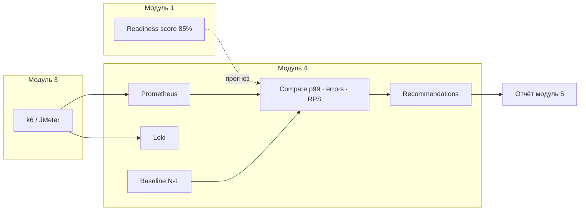
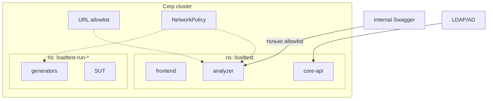
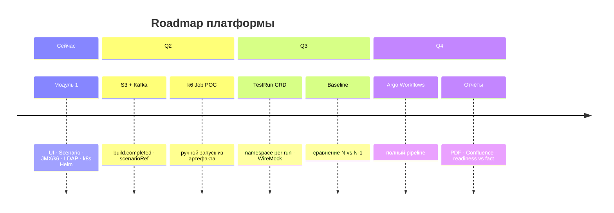

# Архитектура платформы НТ

Краткая схема: **что есть сейчас (модуль 1)** и **куда развивается платформа** по идеям архитектора, НТ-инженера и DevOps.

---

## 1. Общая карта платформы



---

## 2. Сквозной контракт данных

**`Scenario` — единственный источник истины.** JMX и k6.js — производные артефакты.



| Слой | Формат | Где живёт |
|---|---|---|
| Домен | `Scenario` JSON | UI state, PostgreSQL (история 20), **S3** (канон) |
| JMeter | `.jmx` | S3, скачивается runner'ом |
| k6 | `.js` | S3, монтируется в k6-operator Job |
| Метаданные сборки | id, user, engine, timestamp | PostgreSQL + событие Kafka |

PostgreSQL — **метаданные и история**, не бинарники и не большие JSON навсегда.

---

## 3. Модуль 1 — as-is (то, что уже есть)



**Уже реализовано:** auth (LDAP + local), per-user история (20), readiness score в UI, Prometheus listener в JMX.

**Следующий шаг к целевой архитектуре:**
- публикация `build.completed` в Kafka
- выгрузка `Scenario` + артефактов в S3
- allowlist URL для analyzer (app + NetworkPolicy)

---

## 4. Декларативный запуск — CRD `TestRun`



```yaml
# целевой контракт (концепт)
apiVersion: loadtest.corp/v1
kind: TestRun
metadata:
  name: run-42
  namespace: loadtest-run-42
spec:
  scenarioRef: s3://artifacts/user42/build-abc/scenario.json
  engine: k6          # или jmeter
  target:
    baseUrl: http://sut.loadtest-run-42.svc
  profile:
    maxRps: 5000
  baselineRef: run-41   # release N-1
```

**Namespace per run** = изоляция SUT + stubs + generator + метрик прогона.

---

## 5. Оркестрация прогона (Argo Workflows)



| Шаг | Ответственность |
|---|---|
| Deploy | Helm/Kustomize SUT + WireMock + Toxiproxy |
| Smoke | sanity до нагрузки |
| Load | k6-operator (основной) или JMeter (legacy/корреляция) |
| Collect | Prometheus + Loki |
| Analyze | p99, error rate vs baseline N-1 |
| Report | модуль 5 |
| Teardown | удаление namespace |

---

## 6. Выбор движка нагрузки



| Движок | Когда | Метрики |
|---|---|---|
| **k6-operator** | основной, высокий RPS, k8s | Prometheus remote write, checks |
| **JMeter** | legacy, сложная корреляция | Kolesnikov Prometheus listener ✅ |
| **WireMock** | внешние API недоступны | — |
| **Toxiproxy** | latency/timeout/partition | — |

---

## 7. Наблюдаемость и «прогноз vs факт»



**Readiness score (UI)** → после прогона сравнивается с фактом: «прогноз 85%, p99 = OK / FAIL».

---

## 8. Безопасность и границы



| Риск | Контроль |
|---|---|
| SSRF (analyzer → Swagger) | allowlist доменов + NetworkPolicy egress |
| Нагрузка vs prod | отдельный node pool + taints |
| Секреты | Vault / ESO, не в PostgreSQL |
| Изоляция прогонов | namespace per run |

---

## 9. Эволюция по этапам



---

## Резюме

**Сейчас:** модуль 1 готовит `Scenario` и производные `.jmx`/`.js`, хранит метаданные в PostgreSQL, деплоится в k8s через Helm.

**Цель:** `Scenario` и артефакты → **S3**, событие **`build.completed`** → **Kafka** → **Argo Workflows** поднимает **namespace per run** (SUT + WireMock/Toxiproxy), **TestRun CRD** запускает **k6-operator** (основной) или **JMeter** (legacy), метрики идут в **Prometheus + Loki**, модуль 4 сравнивает с **baseline N-1** и связывает **readiness score** с фактом, модуль 5 формирует отчёт.

---

## Просмотр диаграмм локально

Mermaid-диаграммы рендерятся в:
- **VS Code / Cursor** — расширение «Markdown Preview Mermaid Support»
- **GitHub / GitLab** — при push в репозиторий
- **Онлайн** — [mermaid.live](https://mermaid.live) (скопировать блок ` ```mermaid `)

Связанные документы:
- [`platform-roadmap.md`](platform-roadmap.md)
- [`deploy/k8s.md`](deploy/k8s.md)
- [`domain-model.md`](domain-model.md)
