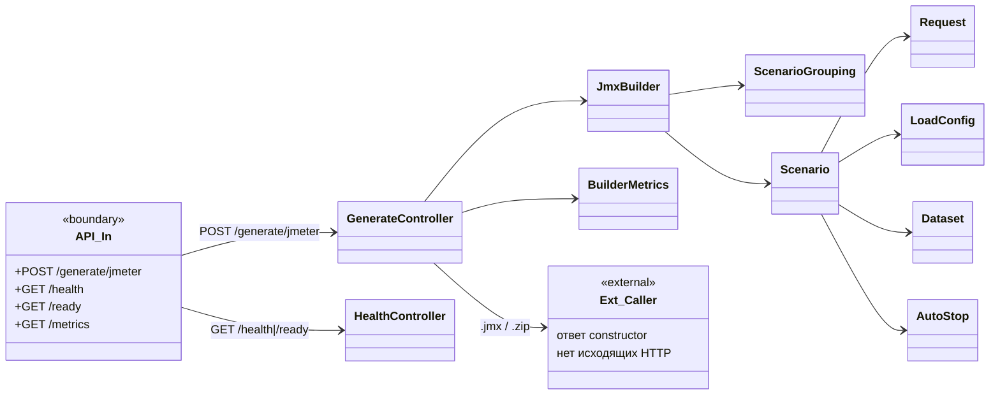
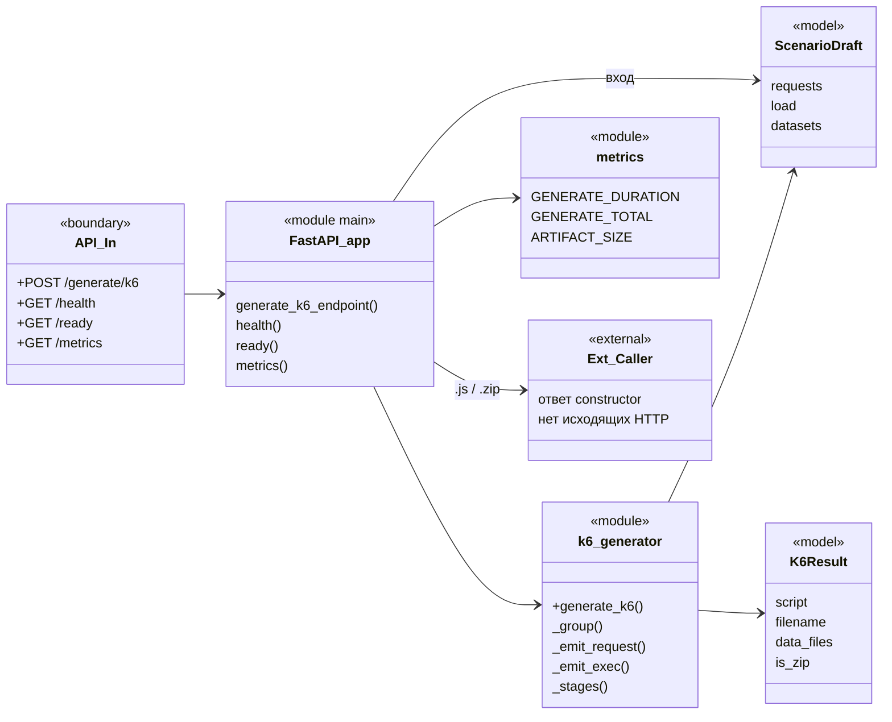

# Схемы классов модулей

На границах каждой схемы:

- **слева** — входящие HTTP-ручки модуля;
- **справа** — исходящие вызовы к другим модулям / внешним системам.

Модели домена (`Scenario`, `Request`, …) показаны фрагментарно — полный контракт в [`domain-model.md`](domain-model.md).

Просмотр: VS Code / Cursor (Mermaid Preview), GitHub/GitLab, [mermaid.live](https://mermaid.live).

---

## 1. `constructor` (Java)

Оркестратор портала: API для frontend, генерация через соседние модули, прогоны, auth, настройки.

```mermaid
classDiagram
  direction LR

  class API_In {
    <<boundary>>
    +POST /api/auth/login
    +POST /api/auth/logout
    +GET /api/auth/me
    +POST /api/auth/change-password
    +POST /api/analyze
    +POST /api/builds/save
    +POST /api/build
    +POST /api/build/k6
    +GET /api/builds
    +GET /api/builds/{id}/scenario
    +GET|POST /api/scripts
    +GET /api/scripts/{id}/download
    +POST|GET /api/runs
    +GET /api/runs/{id}
    +POST /api/runs/webhook/gitlab
    +GET|PUT /api/settings/ldap
    +GET|PUT|POST /api/settings/gitlab*
    +CRUD /api/users
    +GET /health|/ready|/metrics
  }

  class AuthController
  class AnalyzeController
  class BuildController
  class BuildHistoryController
  class ScriptController
  class TestRunController
  class GitLabWebhookController
  class PortalSettingsController
  class GitLabSettingsController
  class UserController
  class HealthController

  class AuthService
  class UserService
  class LdapAuthService
  class BuildHistoryService
  class ScriptService
  class TestRunService
  class PortalSettingsService
  class GitLabSettingsService
  class ModuleEndpoints
  class PortalMetrics
  class DatabaseMetrics

  class AnalyzerClient
  class JmeterBuilderClient
  class K6GeneratorClient
  class GitLabClient

  class SecretResolver {
    <<interface>>
  }
  class CompositeSecretResolver
  class EnvSecretResolver
  class VaultSecretResolver

  class UserRepository
  class AuthSessionRepository
  class BuildRecordRepository
  class ScriptRepository
  class TestRunRepository
  class PortalSettingsRepository

  class HttpClientConfig
  class AuthInterceptor
  class DiscoveryConfig

  class Ext_Analyzer {
    <<external>>
    POST /analyze
  }
  class Ext_JmeterBuilder {
    <<external>>
    POST /generate/jmeter
  }
  class Ext_K6Generator {
    <<external>>
    POST /generate/k6
  }
  class Ext_GitLab {
    <<external>>
    GET /api/v4/projects/{id}
  }
  class Ext_Vault {
    <<external>>
    GET /v1/{kv}/data/{path}
  }
  class Ext_Consul {
    <<external>>
    GET /v1/kv/...
    GET /v1/catalog/service/...
  }
  class Ext_Postgres {
    <<external>>
    JDBC
  }
  class Ext_LDAP {
    <<external>>
    bind/search
  }

  API_In --> AuthController
  API_In --> AnalyzeController
  API_In --> BuildController
  API_In --> BuildHistoryController
  API_In --> ScriptController
  API_In --> TestRunController
  API_In --> GitLabWebhookController
  API_In --> PortalSettingsController
  API_In --> GitLabSettingsController
  API_In --> UserController
  API_In --> HealthController

  AuthController --> AuthService
  AnalyzeController --> AnalyzerClient
  BuildController --> JmeterBuilderClient
  BuildController --> K6GeneratorClient
  BuildController --> BuildHistoryService
  BuildController --> ScriptService
  BuildController --> PortalMetrics
  BuildHistoryController --> BuildHistoryService
  ScriptController --> ScriptService
  TestRunController --> TestRunService
  GitLabWebhookController --> TestRunService
  GitLabWebhookController --> PortalMetrics
  PortalSettingsController --> PortalSettingsService
  GitLabSettingsController --> GitLabSettingsService
  UserController --> UserService
  HealthController --> ModuleEndpoints

  AuthService --> UserRepository
  AuthService --> AuthSessionRepository
  AuthService --> LdapAuthService
  AuthService --> PortalMetrics
  UserService --> UserRepository
  BuildHistoryService --> BuildRecordRepository
  ScriptService --> ScriptRepository
  ScriptService --> PortalMetrics
  TestRunService --> TestRunRepository
  TestRunService --> BuildRecordRepository
  TestRunService --> ScriptService
  TestRunService --> GitLabSettingsService
  TestRunService --> PortalMetrics
  GitLabSettingsService --> PortalSettingsRepository
  GitLabSettingsService --> GitLabClient
  GitLabSettingsService --> SecretResolver
  PortalSettingsService --> PortalSettingsRepository
  ModuleEndpoints --> DiscoveryConfig
  DatabaseMetrics --> BuildRecordRepository
  DatabaseMetrics --> ScriptRepository
  DatabaseMetrics --> TestRunRepository

  CompositeSecretResolver ..|> SecretResolver
  CompositeSecretResolver --> EnvSecretResolver
  CompositeSecretResolver --> VaultSecretResolver

  AnalyzerClient --> ModuleEndpoints
  JmeterBuilderClient --> ModuleEndpoints
  K6GeneratorClient --> ModuleEndpoints
  HttpClientConfig ..> AnalyzerClient : sharedRestClient
  HttpClientConfig ..> JmeterBuilderClient
  HttpClientConfig ..> K6GeneratorClient
  HttpClientConfig ..> GitLabClient
  HttpClientConfig ..> VaultSecretResolver
  AuthInterceptor --> AuthService

  AnalyzerClient --> Ext_Analyzer
  JmeterBuilderClient --> Ext_JmeterBuilder
  K6GeneratorClient --> Ext_K6Generator
  GitLabClient --> Ext_GitLab
  VaultSecretResolver --> Ext_Vault
  ModuleEndpoints --> Ext_Consul
  LdapAuthService --> Ext_LDAP
  UserRepository --> Ext_Postgres
  BuildRecordRepository --> Ext_Postgres
  ScriptRepository --> Ext_Postgres
  TestRunRepository --> Ext_Postgres
  PortalSettingsRepository --> Ext_Postgres
```

---

## 2. `jmeter-builder` (Java)

Stateless генератор `.jmx` / zip. Исходящих HTTP нет — ответ уходит вызывающему `constructor`.



---

## 3. `analyzer` (Python / FastAPI)

Разбор OpenAPI / Postman → `ScenarioDraft`. При `url` ходит наружу одним общим `httpx.AsyncClient` (lifespan).

```mermaid
classDiagram
  direction LR

  class API_In {
    <<boundary>>
    +POST /analyze
    +GET /health
    +GET /ready
    +GET /metrics
  }

  class FastAPI_app {
    <<module main>>
    lifespan()
    _http() AsyncClient
    analyze()
    health()
    ready()
    metrics()
    _resolve_content()
    enrich()
  }

  class openapi_parser {
    <<module>>
    +parse_openapi()
    _RefResolver
    _build_request()
  }

  class postman_parser {
    <<module>>
    +parse_postman()
    _build_request()
  }

  class metrics {
    <<module>>
    ANALYZE_DURATION
    ANALYZE_TOTAL
    FETCH_DURATION
    REQUESTS_IN_DRAFT
  }

  class AnalyzeRequest {
    <<model>>
    source_type
    url?
    content?
    name?
  }

  class ScenarioDraft {
    <<model>>
    name
    base_url
    requests
    load
    datasets
  }

  class Ext_OpenAPI_URL {
    <<external>>
    GET {user.url}
    swagger-config / v3/api-docs
  }

  class Ext_Caller {
    <<external>>
    ответ constructor
  }

  API_In --> FastAPI_app
  FastAPI_app --> AnalyzeRequest : вход
  FastAPI_app --> openapi_parser : source=openapi
  FastAPI_app --> postman_parser : source=postman
  FastAPI_app --> metrics
  openapi_parser --> ScenarioDraft
  postman_parser --> ScenarioDraft
  FastAPI_app --> ScenarioDraft : выход + enrich

  FastAPI_app --> Ext_OpenAPI_URL : только если url\n(общий AsyncClient)
  FastAPI_app --> Ext_Caller : ScenarioDraft JSON
```

---

## 4. `k6-generator` (Python / FastAPI)

Генерация `.js` / zip из `ScenarioDraft`. Исходящих HTTP нет.



---

## Сводка границ

| Модуль | Входящие ручки (рабочие) | Исходящие вызовы |
|---|---|---|
| **constructor** | `/api/*`, `/health`, `/ready`, `/metrics` | analyzer, jmeter-builder, k6-generator, GitLab, Vault, Consul, Postgres, LDAP |
| **jmeter-builder** | `POST /generate/jmeter` | — (только ответ caller) |
| **analyzer** | `POST /analyze` | HTTP GET к URL спеки (если передан `url`) |
| **k6-generator** | `POST /generate/k6` | — (только ответ caller) |

Цепочка сборки:

```
frontend → constructor → analyzer | jmeter-builder | k6-generator
                              ↓
                         Postgres (builds / scripts / runs)
```
