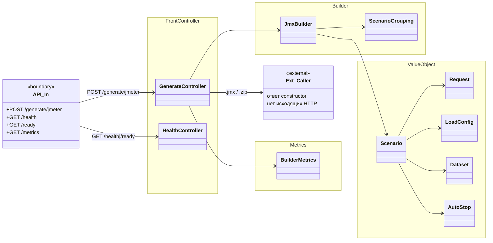
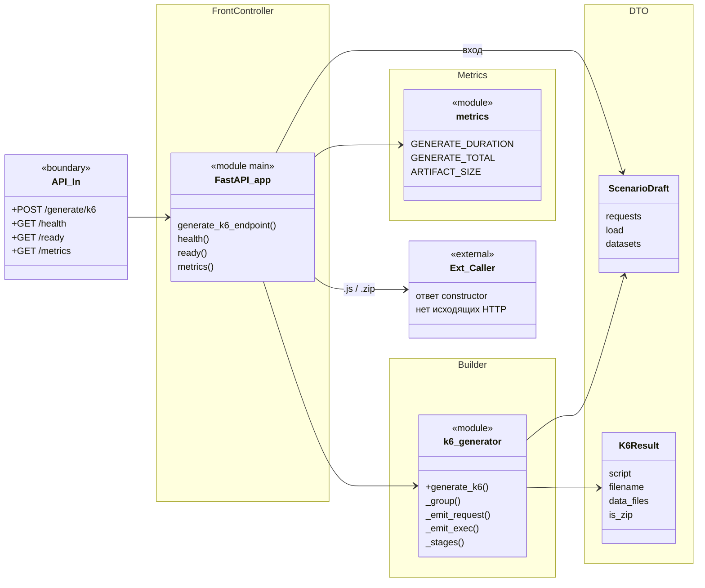

# Схемы классов модулей

Классы сгруппированы по **паттернам**, которые реально есть в коде — не по пакетам и не по «слоям ради слоёв».

На границах каждой модульной схемы:

- **слева** — входящие HTTP-ручки;
- **справа** — исходящие вызовы к другим модулям / внешним системам.

Модели домена (`Scenario`, `Request`, …) показаны фрагментарно — полный контракт в [`domain-model.md`](domain-model.md).

Просмотр: VS Code / Cursor (Mermaid Preview), GitHub/GitLab, [mermaid.live](https://mermaid.live).

---

## Группы паттернов

| Группа | Что это здесь | Где |
|---|---|---|
| **Front Controller** | REST-ручки, один вход на ресурс | `*Controller`, FastAPI `app` |
| **Exception Handler** | Глобальный перевод исключений в HTTP | `ApiExceptionHandler` |
| **Interceptor / Filter** | Цепочка до/после хендлера (Chain of Responsibility) | `AuthInterceptor`, `RequestLoggingFilter` |
| **Application Service / Facade** | Оркестрация use-case, без HTTP и SQL вперемешку | `*Service`, `GitLabPipelineLauncher` |
| **Gateway / Adapter** | Обёртка внешнего HTTP API | `*Client`, `VaultSecretResolver`, `LdapAuthService` |
| **Strategy + Chain** | Подменяемый способ резолва секрета; fallback Vault → env | `SecretResolver` |
| **Service Locator** | Резолв URL соседей (Consul / override / env) | `ModuleEndpoints` |
| **Resolver** | Сборка входного объекта из нескольких источников | `ScriptSourceResolver` |
| **Mapper** | Entity ↔ DTO, побочные представления | `TestRunMapper` |
| **Repository** | Доступ к Postgres (Spring Data) | `*Repository` |
| **Entity** | Строка таблицы | `*Entity` |
| **DTO** | Контракт HTTP API | `web.dto.*`, pydantic-модели входа/выхода |
| **Value Object** | Доменный JSON-контракт, без identity | `model.*`, `ScriptSource`, `LaunchParams` |
| **Builder** | Пошаговая сборка артефакта | `JmxBuilder`, `generate_k6()` |
| **Factory** | Единая точка создания HTTP-клиентов | `HttpClientConfig` |
| **Parser Strategy** | Разбор OpenAPI vs Postman в один `ScenarioDraft` | `openapi_parser`, `postman_parser` |
| **Observer (webhook)** | Входящий callback статуса pipeline | `GitLabWebhookController` → `TestRunWebhookService` |
| **Scheduled Command** | Периодическая чистка | `BuildRetentionJob` |
| **Context Object** | Кто вошёл в запрос | `AuthContext` |
| **Metrics Collector** | Доменные счётчики/gauge | `PortalMetrics`, `DatabaseMetrics`, `BuilderMetrics` |
| **Bootstrap / Config** | Старт, CORS, discovery, seed | `*Application`, `WebConfig`, `DiscoveryConfig`, `DataInitializer` |

`CompositeSecretResolver` назван Composite, по факту это **цепочка fallback** (Chain of Responsibility) над двумя Strategy, а не дерево объектов.

---

## Каталог: все классы по группам

### Front Controller

| Модуль | Класс |
|---|---|
| constructor | `AuthController`, `AnalyzeController`, `BuildController`, `BuildHistoryController`, `ScriptController`, `PortalSettingsController`, `UserController`, `HealthController` |
| orchestrator | `TestRunController`, `GitLabWebhookController`, `GitLabSettingsController`, `HealthController` |
| jmeter-builder | `GenerateController`, `HealthController` |
| analyzer | `FastAPI` (`analyze`, `health`, `ready`, `metrics`) |
| k6-generator | `FastAPI` (`generate_k6_endpoint`, `health`, `ready`, `metrics`) |

### Exception Handler

| Модуль | Класс |
|---|---|
| constructor | `ApiExceptionHandler` |
| orchestrator | `ApiExceptionHandler` (`GitLabException` → 502) |

### Interceptor / Filter

| Модуль | Класс | Роль |
|---|---|---|
| constructor, orchestrator | `AuthInterceptor` | Bearer → `AuthContext`; login/webhook исключены |
| constructor, orchestrator | `RequestLoggingFilter` | MDC `username` / `run_id`, latency |

### Application Service / Facade

| Модуль | Класс |
|---|---|
| constructor | `AuthService`, `UserService`, `BuildHistoryService`, `ScriptService`, `PortalSettingsService` |
| orchestrator | `TestRunService`, `TestRunWebhookService`, `GitLabSettingsService`, `PortalSettingsService`, `ScriptService`, `GitLabPipelineLauncher` |

`GitLabPipelineLauncher` — инфраструктурный фасад: upload + trigger **вне** транзакции создания прогона.

### Gateway / Adapter

| Модуль | Класс | Внешняя система |
|---|---|---|
| constructor | `AnalyzerClient` | analyzer `POST /analyze` |
| constructor | `JmeterBuilderClient` | jmeter-builder `POST /generate/jmeter` |
| constructor | `K6GeneratorClient` | k6-generator `POST /generate/k6` |
| constructor | `LdapAuthService` | LDAP bind/search |
| constructor, orchestrator | `VaultSecretResolver` | Vault KV v2 |
| orchestrator | `GitLabClient` | GitLab Files + trigger pipeline |

### Strategy + Chain (секреты)

| Класс | Роль |
|---|---|
| `SecretResolver` | интерфейс Strategy |
| `VaultSecretResolver` | Strategy: Vault |
| `EnvSecretResolver` | Strategy: env (dev / fallback) |
| `CompositeSecretResolver` | `@Primary`: Vault если включён, иначе env |

Одинаковый набор в constructor и orchestrator.

### Service Locator / Resolver / Mapper

| Модуль | Класс | Паттерн |
|---|---|---|
| constructor | `ModuleEndpoints` | Service Locator URL соседей |
| orchestrator | `ScriptSourceResolver` | Resolver → `ScriptSource` |
| orchestrator | `TestRunMapper` | Mapper entity ↔ `TestRunDto` + Grafana URL + журнал событий |
| orchestrator | `JsonSupport`, `TextSupport` | утилиты, не паттерн |

### Repository + Entity

Одинаковая схема Postgres у constructor и orchestrator (общая БД).

| Repository | Entity | Таблица |
|---|---|---|
| `UserRepository` | `UserEntity` | `portal_users` |
| `AuthSessionRepository` | `AuthSessionEntity` | `auth_sessions` |
| `BuildRecordRepository` | `BuildRecordEntity` | `build_records` |
| `ScriptRepository` | `ScriptEntity` | `scripts` |
| `TestRunRepository` | `TestRunEntity` | `test_runs` |
| `PortalSettingsRepository` | `PortalSettingsEntity` | `portal_settings` |

### DTO (HTTP)

**constructor:** `LoginRequest`, `LoginResponse`, `ChangePasswordRequest`, `ChangeOwnPasswordRequest`, `CreateUserRequest`, `UserDto`, `AnalyzeRequest`, `BuildSaveRequest`, `BuildSaveResponse`, `BuildRecordSummary`, `ScriptSummary`, `LdapSettingsDto`.

**orchestrator:** `CreateTestRunRequest`, `TestRunDto`, `TestRunEventDto`, `GitLabSettingsDto`, `GitLabRunDefaultsDto`, `GitLabTestConnectionResult`.

**analyzer:** `AnalyzeRequest` → `ScenarioDraft`.

**k6-generator:** `ScenarioDraft` → `K6Result`.

### Value Object / Domain Model

**constructor / jmeter-builder** (`model.*`, records/enums): `Scenario`, `Request`, `Body`, `Param`, `ParamSource`, `Extraction`, `Validation`, `Dataset`, `LoadConfig`, `Intensity`, `AutoStop`, `PrometheusConfig`, `Generator`, `KeyValue`; enums `HttpMethod`, `SourceType`, `BodyMode`, `ParamLocation`, `ExtractionType`, `GeneratorType`, `TestMode`, `UserRole`, `TestRunStatus`.

**orchestrator:** `ScriptSource`, `LaunchParams`; enums `TestRunStatus`, `UserRole`.

**analyzer / k6-generator:** pydantic-копия того же контракта (`ScenarioDraft`, `Request`, …).

### Builder / Parser Strategy

| Модуль | Класс | Паттерн |
|---|---|---|
| jmeter-builder | `JmxBuilder` | Builder `.jmx` |
| jmeter-builder | `ScenarioGrouping` | группировка запросов в тред-группы (вход Builder) |
| k6-generator | `k6_generator.generate_k6` | Builder `.js` / zip |
| analyzer | `openapi_parser.parse_openapi` | Parser Strategy |
| analyzer | `postman_parser.parse_postman` | Parser Strategy |
| analyzer | `enrich()` | точка расширения после Strategy |

### Factory / Interceptor wiring / Bootstrap

| Модуль | Класс | Роль |
|---|---|---|
| constructor, orchestrator | `HttpClientConfig` | Factory: `sharedRestClient`, `probeRestClient` |
| constructor, orchestrator | `WebConfig` | CORS + регистрация `AuthInterceptor` |
| constructor, orchestrator | `DiscoveryConfig` | Consul / Vault / modules.* |
| constructor | `DataInitializer` | seed admin + `portal_settings` |
| constructor | `DbInitExitRunner` | Liquibase-job: применить схему и `System.exit` |
| constructor | `ConstructorApplication` | bootstrap |
| orchestrator | `OrchestratorApplication` | bootstrap |
| jmeter-builder | `JmeterBuilderApplication` | bootstrap |

### Observer, Job, Context, Metrics, Exceptions

| Группа | Классы |
|---|---|
| Observer (webhook) | `GitLabWebhookController`, `TestRunWebhookService` |
| Scheduled Command | `BuildRetentionJob` |
| Context Object | `AuthContext` (constructor, orchestrator) |
| Metrics Collector | constructor: `PortalMetrics`, `DatabaseMetrics`; orchestrator: `PortalMetrics`; jmeter-builder: `BuilderMetrics`; analyzer/k6: модуль `metrics` |
| Runtime exception | `GitLabException` |

---

## 1. `constructor` (Java)

Auth, сценарий/сборка, история, LDAP/users, Liquibase. Прогоны вынесены в `orchestrator`.

```mermaid
classDiagram
  direction LR

  class API_In {
    <<boundary>>
    +POST /api/auth/login
    +POST /api/auth/logout
    +GET /api/auth/me
    +POST /api/auth/change-password
    +POST /api/analyze
    +POST /api/builds/save
    +POST /api/build
    +POST /api/build/k6
    +GET /api/builds
    +GET /api/builds/{id}/scenario
    +DELETE /api/builds/{id}
    +GET|POST /api/scripts
    +GET /api/scripts/{id}/download
    +GET|PUT /api/settings/ldap
    +CRUD /api/users
    +GET /health|/ready|/metrics
  }

  namespace FrontController {
    class AuthController
    class AnalyzeController
    class BuildController
    class BuildHistoryController
    class ScriptController
    class PortalSettingsController
    class UserController
    class HealthController
  }

  namespace ExceptionHandler {
    class ApiExceptionHandler
  }

  namespace InterceptorFilter {
    class AuthInterceptor
    class RequestLoggingFilter
    class WebConfig
  }

  namespace ApplicationService {
    class AuthService
    class UserService
    class BuildHistoryService
    class ScriptService
    class PortalSettingsService
  }

  namespace GatewayAdapter {
    class AnalyzerClient
    class JmeterBuilderClient
    class K6GeneratorClient
    class LdapAuthService
  }

  namespace StrategyChain {
    class SecretResolver {
      <<interface>>
      +resolve(path) Optional
    }
    class CompositeSecretResolver
    class EnvSecretResolver
    class VaultSecretResolver
  }

  namespace ServiceLocator {
    class ModuleEndpoints
  }

  namespace Repository {
    class UserRepository
    class AuthSessionRepository
    class BuildRecordRepository
    class ScriptRepository
    class TestRunRepository
    class PortalSettingsRepository
  }

  namespace FactoryConfig {
    class HttpClientConfig
    class DiscoveryConfig
    class DataInitializer
    class DbInitExitRunner
  }

  namespace Job {
    class BuildRetentionJob
  }

  namespace ContextMetrics {
    class AuthContext
    class PortalMetrics
    class DatabaseMetrics
  }

  class Ext_Analyzer {
    <<external>>
    POST /analyze
  }
  class Ext_JmeterBuilder {
    <<external>>
    POST /generate/jmeter
  }
  class Ext_K6Generator {
    <<external>>
    POST /generate/k6
  }
  class Ext_Vault {
    <<external>>
    GET /v1/{kv}/data/{path}
  }
  class Ext_Consul {
    <<external>>
    GET /v1/kv/...
    GET /v1/catalog/service/...
  }
  class Ext_Postgres {
    <<external>>
    JDBC
  }
  class Ext_LDAP {
    <<external>>
    bind/search
  }

  API_In --> AuthController
  API_In --> AnalyzeController
  API_In --> BuildController
  API_In --> BuildHistoryController
  API_In --> ScriptController
  API_In --> PortalSettingsController
  API_In --> UserController
  API_In --> HealthController

  WebConfig --> AuthInterceptor
  AuthInterceptor --> AuthService
  AuthInterceptor --> AuthContext
  RequestLoggingFilter ..> AuthContext : MDC

  AuthController --> AuthService
  AnalyzeController --> AnalyzerClient
  BuildController --> JmeterBuilderClient
  BuildController --> K6GeneratorClient
  BuildController --> BuildHistoryService
  BuildController --> ScriptService
  BuildController --> PortalMetrics
  BuildHistoryController --> BuildHistoryService
  ScriptController --> ScriptService
  PortalSettingsController --> PortalSettingsService
  UserController --> UserService
  HealthController --> ModuleEndpoints

  AuthService --> UserRepository
  AuthService --> AuthSessionRepository
  AuthService --> LdapAuthService
  AuthService --> PortalMetrics
  UserService --> UserRepository
  BuildHistoryService --> BuildRecordRepository
  ScriptService --> ScriptRepository
  ScriptService --> PortalMetrics
  PortalSettingsService --> PortalSettingsRepository
  BuildRetentionJob --> BuildHistoryService

  CompositeSecretResolver ..|> SecretResolver
  EnvSecretResolver ..|> SecretResolver
  VaultSecretResolver ..|> SecretResolver
  CompositeSecretResolver --> EnvSecretResolver
  CompositeSecretResolver --> VaultSecretResolver
  CompositeSecretResolver --> DiscoveryConfig

  AnalyzerClient --> ModuleEndpoints
  JmeterBuilderClient --> ModuleEndpoints
  K6GeneratorClient --> ModuleEndpoints
  ModuleEndpoints --> DiscoveryConfig
  HttpClientConfig ..> AnalyzerClient : sharedRestClient
  HttpClientConfig ..> JmeterBuilderClient
  HttpClientConfig ..> K6GeneratorClient
  HttpClientConfig ..> VaultSecretResolver
  HttpClientConfig ..> ModuleEndpoints : probeRestClient
  HttpClientConfig ..> HealthController : probeRestClient

  DatabaseMetrics --> BuildRecordRepository
  DatabaseMetrics --> ScriptRepository
  DatabaseMetrics --> TestRunRepository

  AnalyzerClient --> Ext_Analyzer
  JmeterBuilderClient --> Ext_JmeterBuilder
  K6GeneratorClient --> Ext_K6Generator
  VaultSecretResolver --> Ext_Vault
  ModuleEndpoints --> Ext_Consul
  LdapAuthService --> Ext_LDAP
  UserRepository --> Ext_Postgres
  BuildRecordRepository --> Ext_Postgres
  ScriptRepository --> Ext_Postgres
  TestRunRepository --> Ext_Postgres
  PortalSettingsRepository --> Ext_Postgres
```

Entity / DTO / VO constructor в mermaid не дублируются — см. каталог выше и [`domain-model.md`](domain-model.md).

---

## 1b. `orchestrator` (Java)

Модуль «Запуск»: GitLab trigger/upload, webhook, настройки GitLab. Общая Postgres и `auth_sessions` с constructor.

```mermaid
classDiagram
  direction LR

  class API_In {
    <<boundary>>
    +POST|GET /api/runs
    +GET /api/runs/{id}
    +POST /api/runs/webhook/gitlab
    +GET|PUT|POST /api/settings/gitlab*
    +GET /health|/ready|/metrics
  }

  namespace FrontController {
    class TestRunController
    class GitLabWebhookController
    class GitLabSettingsController
    class HealthController
  }

  namespace ExceptionHandler {
    class ApiExceptionHandler
  }

  namespace InterceptorFilter {
    class AuthInterceptor
    class RequestLoggingFilter
    class WebConfig
  }

  namespace ApplicationService {
    class TestRunService
    class TestRunWebhookService
    class GitLabSettingsService
    class PortalSettingsService
    class ScriptService
    class AuthService
    class GitLabPipelineLauncher
  }

  namespace ResolverMapper {
    class ScriptSourceResolver
    class TestRunMapper
    class JsonSupport
  }

  namespace GatewayAdapter {
    class GitLabClient
    class GitLabException
  }

  namespace StrategyChain {
    class SecretResolver {
      <<interface>>
    }
    class CompositeSecretResolver
    class EnvSecretResolver
    class VaultSecretResolver
  }

  namespace Repository {
    class AuthSessionRepository
    class UserRepository
    class TestRunRepository
    class BuildRecordRepository
    class ScriptRepository
    class PortalSettingsRepository
  }

  namespace ValueObject {
    class ScriptSource
    class LaunchParams
    class AuthContext
  }

  namespace FactoryConfig {
    class HttpClientConfig
    class DiscoveryConfig
  }

  namespace Metrics {
    class PortalMetrics
  }

  class Ext_GitLab {
    <<external>>
    Repository Files + trigger pipeline
  }
  class Ext_Vault {
    <<external>>
    GET /v1/{kv}/data/{path}
  }
  class Ext_Postgres {
    <<external>>
    JDBC shared DB
  }

  API_In --> TestRunController
  API_In --> GitLabWebhookController
  API_In --> GitLabSettingsController
  API_In --> HealthController

  WebConfig --> AuthInterceptor
  AuthInterceptor --> AuthService
  AuthInterceptor --> AuthContext

  TestRunController --> TestRunService
  GitLabWebhookController --> TestRunWebhookService
  GitLabWebhookController --> PortalMetrics
  GitLabSettingsController --> GitLabSettingsService

  TestRunService --> ScriptSourceResolver
  TestRunService --> GitLabPipelineLauncher
  TestRunService --> TestRunMapper
  TestRunService --> TestRunRepository
  TestRunService --> PortalSettingsService
  TestRunService --> PortalMetrics
  ScriptSourceResolver --> BuildRecordRepository
  ScriptSourceResolver --> ScriptService
  ScriptSourceResolver --> ScriptSource
  GitLabPipelineLauncher --> GitLabClient
  GitLabPipelineLauncher --> GitLabSettingsService
  GitLabPipelineLauncher --> TestRunMapper
  GitLabPipelineLauncher --> LaunchParams
  TestRunWebhookService --> TestRunRepository
  TestRunWebhookService --> GitLabSettingsService
  TestRunWebhookService --> TestRunMapper
  TestRunMapper --> JsonSupport
  ScriptService --> ScriptRepository
  GitLabSettingsService --> PortalSettingsService
  GitLabSettingsService --> GitLabClient
  GitLabSettingsService --> SecretResolver
  PortalSettingsService --> PortalSettingsRepository
  AuthService --> AuthSessionRepository
  AuthService --> UserRepository
  GitLabClient --> GitLabException

  CompositeSecretResolver ..|> SecretResolver
  EnvSecretResolver ..|> SecretResolver
  VaultSecretResolver ..|> SecretResolver
  CompositeSecretResolver --> EnvSecretResolver
  CompositeSecretResolver --> VaultSecretResolver

  HttpClientConfig ..> GitLabClient : sharedRestClient
  HttpClientConfig ..> VaultSecretResolver
  ApiExceptionHandler ..> GitLabException

  GitLabClient --> Ext_GitLab
  VaultSecretResolver --> Ext_Vault
  TestRunRepository --> Ext_Postgres
  AuthSessionRepository --> Ext_Postgres
  PortalSettingsRepository --> Ext_Postgres
```

Поток прогона: Controller → Facade (`TestRunService`) → Resolver (`ScriptSource`) → Launcher (вне txn) → Gateway (`GitLabClient`). Статус возвращается Observer-ом (`webhook`).

---

## 2. `jmeter-builder` (Java)

Stateless генератор `.jmx` / zip. Исходящих HTTP нет — ответ уходит вызывающему `constructor`.



Остальные VO (`Body`, `Param`, `Extraction`, `Intensity`, …) — тот же контракт, что у constructor; см. каталог.

---

## 3. `analyzer` (Python / FastAPI)

Разбор OpenAPI / Postman → `ScenarioDraft`. При `url` ходит наружу одним общим `httpx.AsyncClient` (lifespan).

```mermaid
classDiagram
  direction LR

  class API_In {
    <<boundary>>
    +POST /analyze
    +GET /health
    +GET /ready
    +GET /metrics
  }

  namespace FrontController {
    class FastAPI_app {
      <<module main>>
      lifespan()
      _http() AsyncClient
      analyze()
      health()
      ready()
      metrics()
      enrich()
    }
  }

  namespace ParserStrategy {
    class openapi_parser {
      <<module>>
      +parse_openapi()
      _RefResolver
      _build_request()
    }
    class postman_parser {
      <<module>>
      +parse_postman()
      _build_request()
    }
  }

  namespace DTO {
    class AnalyzeRequest {
      source_type
      url?
      content?
      name?
    }
    class ScenarioDraft {
      name
      base_url
      requests
      load
      datasets
    }
  }

  namespace Metrics {
    class metrics {
      <<module>>
      ANALYZE_DURATION
      ANALYZE_TOTAL
      FETCH_DURATION
      REQUESTS_IN_DRAFT
    }
  }

  class Ext_OpenAPI_URL {
    <<external>>
    GET {user.url}
    swagger-config / v3/api-docs
  }
  class Ext_Caller {
    <<external>>
    ответ constructor
  }

  API_In --> FastAPI_app
  FastAPI_app --> AnalyzeRequest : вход
  FastAPI_app --> openapi_parser : source=openapi
  FastAPI_app --> postman_parser : source=postman
  FastAPI_app --> metrics
  openapi_parser --> ScenarioDraft
  postman_parser --> ScenarioDraft
  FastAPI_app --> ScenarioDraft : выход + enrich

  FastAPI_app --> Ext_OpenAPI_URL : только если url\n(общий AsyncClient)
  FastAPI_app --> Ext_Caller : ScenarioDraft JSON
```

`source_type` выбирает Parser Strategy. `enrich()` — хук после парсера, не отдельный класс.

---

## 4. `k6-generator` (Python / FastAPI)

Генерация `.js` / zip из `ScenarioDraft`. Исходящих HTTP нет.



---

## Сводка границ

| Модуль | Входящие ручки (рабочие) | Исходящие вызовы |
|---|---|---|
| **constructor** | auth/builds/scripts/users/ldap, `/health`, `/ready`, `/metrics` | analyzer, jmeter-builder, k6-generator, Vault, Consul, Postgres, LDAP |
| **orchestrator** | `/api/runs*`, `/api/settings/gitlab*`, `/health`, `/ready`, `/metrics` | GitLab, Vault, Postgres (общая) |
| **jmeter-builder** | `POST /generate/jmeter` | — (только ответ caller) |
| **analyzer** | `POST /analyze` | HTTP GET к URL спеки (если передан `url`) |
| **k6-generator** | `POST /generate/k6` | — (только ответ caller) |

Цепочка:

```
frontend → /api → constructor → analyzer | jmeter-builder | k6-generator
         ↘ /api/runs|gitlab → orchestrator → GitLab
                              ↓
                         Postgres (общая)
```
